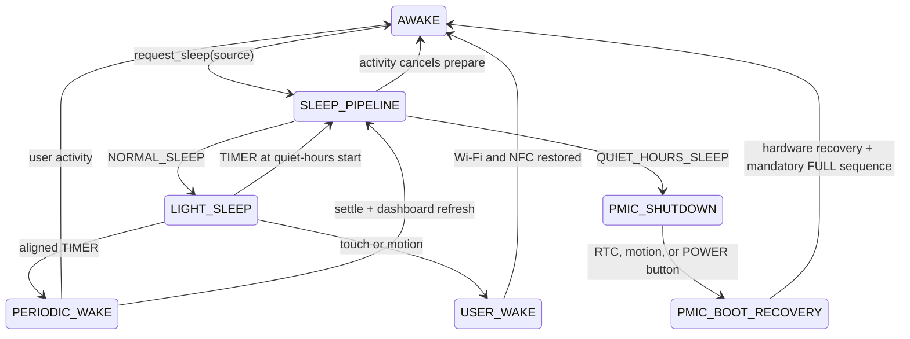

# Power Management

[English](Power_Management.md) | [Español](es/Power_Management.md)

The device has two distinct low-power mechanisms: ESP32 light sleep, which can wake periodically without rebooting, and M5PM1 shutdown, which removes the ESP32 rail and requires a new boot. Every request to sleep goes through one pipeline. The current clock chooses the mode: outside quiet hours the device enters light sleep; inside quiet hours it uses PMIC shutdown.

## Unified sleep pipeline

All origins call the same entry point: inactivity timeout, the awake scheduler, a periodic TIMER recovery, a quiet-hours TIMER, `sleep_now`, and `shutdown_until`. Internally that is `request_sleep_(source)` (with an explicit quiet-hours force only for `shutdown_until`).

`determine_sleep_mode_()` is the only quiet-hours decision. If the current time is inside the window, or `shutdown_until` forced the nocturnal path, the mode is `QUIET_HOURS_SLEEP`. Otherwise it is `NORMAL_SLEEP`. A temporary user session during the night does not cancel quiet hours for the rest of the night: the next sleep request consults the clock again.

Preparation is shared, but the visual step depends on the mode:

1. Ignore a duplicate request while the pipeline is already active.
2. Leave Controls if needed.
3. Turn the status LED policy off (`status_led_sleep_pending`).
4. For `QUIET_HOURS_SLEEP` only: set `sleep_visual_active` and commit one e-paper refresh with ZZZ, unless a caller such as a quiet-hours periodic path already committed it.
5. For `NORMAL_SLEEP`: leave the dashboard as-is. Do not set ZZZ and do not request a sleep-only refresh. Wait on the display only if a refresh is already in flight (Controls exit or periodic-wake dashboard update).
6. Re-evaluate the mode (the clock may have crossed quiet start during the wait).
7. Turn the frontlight off if it is still on.
8. Disable Wi-Fi.
9. Configure wake sources and, for light sleep, stop NFC.
10. Enter `esp_light_sleep_start()` or M5PM1 shutdown.

Wi-Fi stays up during the e-paper wait so a notification can still cancel the pipeline. It is dropped only immediately before the physical sleep/shutdown.

## NORMAL_SLEEP

Light sleep keeps the ESP32 in RAM retention and **keeps the current dashboard on the e-paper** (time, weather, sensors). There is no ZZZ overlay and no extra refresh just to enter sleep, so the panel still looks like an active clock while the ESP32 is asleep. The timer is aligned to the next multiple of the configured refresh interval when HA time is valid; without valid time it uses one full interval. A daytime timer can be shortened to quiet-hours start so that wake takes the nocturnal pipeline instead of a periodic refresh. Wake sources remain the timer, touch GPIO, and PMIC EXT1 (motion).

## QUIET_HOURS_SLEEP

Quiet hours are a separate architecture, not a longer light-sleep interval. The firmware sets `sleep_visual_active`, paints ZZZ with one final refresh, waits for the panel to go idle, programs the RX8130 RTC to `quiet_hours_end` (or the `shutdown_until` `wake_at`), keeps the M5PM1 L1 domain for RTC/BMI270/POWER wake, and executes PMIC shutdown. There are no `/5` periodic wakes while the ESP32 rail is off. Setting quiet-hours start equal to end disables the window.

Touch cannot wake the device from PMIC shutdown. RTC, motion, and POWER can. Motion or POWER wake during quiet hours sets `quiet_hours_user_override` as an informational boot marker; it is not a sleep-mode bypass. The next inactivity timeout still asks `determine_sleep_mode_()` and returns to `QUIET_HOURS_SLEEP` if the clock is still inside the window.

## Sleep visual (ZZZ)

`sleep_visual_active` means **quiet-hours / prolonged shutdown**, not “any sleep”. The renderer reads only that flag. `NORMAL_SLEEP` never sets it, so the retained dashboard stays on the panel. The quiet-hours pipeline sets the flag before its single final refresh and clears it on cancel. If a periodic TIMER recovery happens to land inside quiet hours, that one settle refresh already includes ZZZ so shutdown does not paint a second frame.

## Cancellation

Touch, notification, or relevant motion during prepare calls `cancel_sleep_pipeline_()`: pending phase, visual, LED-sleep, and HA manual timers are cleared. If quiet-hours ZZZ had been painted, touch/motion restore the live dashboard with a `sleep_cancel` refresh; notification uses its own fullscreen refresh. `NORMAL_SLEEP` never armed ZZZ, so it does not need that restore refresh. A last-moment touch IRQ still held low after wake-source arming aborts `esp_light_sleep_start()`, restores Wi-Fi, and either stays in the pipeline or yields to the activity cancel.

## AWAKE, activity, and periodic wake

Touch and BMI270 motion are the only activity sources. Activity turns on the frontlight at the configured brightness, resets inactivity timing, and cancels a pending sleep transition. Physical navigation/POWER buttons, NFC, Home Assistant updates, display work, buzzer feedback, and status LED work do not reset the activity clock. The inactivity clock starts at boot. The frontlight and sleep timeouts remain independent.

Other TIMER wakes enable Wi-Fi but keep NFC off, wait up to 30,000 ms for Wi-Fi/API, and then spend 1,750 ms in SETTLE. The subsequent refresh updates the dashboard without ZZZ, then the same `request_sleep_()` pipeline re-enters `NORMAL_SLEEP` and keeps that frame. If the clock is inside quiet hours at that point, the settle refresh includes ZZZ and the pipeline takes `QUIET_HOURS_SLEEP` instead. User activity cancels periodic recovery and restores active operation, including NFC.

The native `sleep_now` action is a sleep request. If quiet hours are active it follows `QUIET_HOURS_SLEEP`; otherwise it uses light sleep. Its optional `wake_at` selects a time-of-day light-sleep wake when the mode is `NORMAL_SLEEP`. `shutdown_until` forces the PMIC shutdown architecture and requires a valid `wake_at`.

## User wake

Touch wakes through the touch GPIO. Motion is routed through BMI270 → M5PM1 GPIO4. User wake enables Wi-Fi and resumes NFC. If a quiet-hours ZZZ frame was on the panel, the visual flag is cleared and the dashboard is restored. After `NORMAL_SLEEP` the dashboard is already on the panel, so no extra refresh is required. TIMER wake keeps NFC off and, outside quiet hours, leaves the dashboard in place for the next return to light sleep.

## PMIC boot recovery

After a recognized PMIC wake, the ESP32 boots again. M5IOE1, e-paper power/reset, touch, and frontlight hardware are restored. The e-paper baseline is invalidated and an initial `MANDATORY_FULL` is required before any PARTIAL. Recovery then waits for Wi-Fi/API connection; this connection wait does not use the periodic wake's 30-second fallback. Once HA connects, required dashboard data is polled for up to 5 seconds. Whether all data arrives or that data timeout expires, the firmware requests a final `RefreshKind::MANDATORY_FULL` to paint the definitive available state, after which PARTIAL refreshes can be used.

Useful logs include `PMIC boot cause`, `PMIC wake recovery summary`, `PMIC wake: EPD ready`, and `PMIC boot: mandatory initial FULL complete`. With USB/5VIN present, a shutdown command is still issued, but external power may immediately repower the ESP32 rail, so the device may not remain off.
