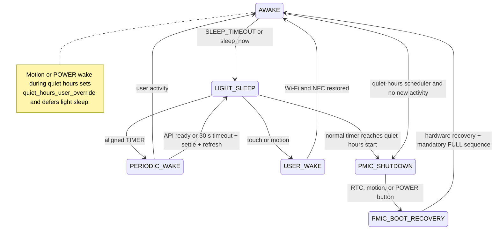

# Power Management

The device has two distinct low-power mechanisms: ESP32 light sleep, which can wake periodically without rebooting, and M5PM1 shutdown, which removes the ESP32 rail and requires a new boot. Quiet hours normally route an inactive device to PMIC shutdown, subject to the timeout, manual-action, and user-override exceptions below.

## AWAKE and light sleep

Touch and BMI270 motion are the only activity sources. Activity turns on the frontlight at the configured brightness, resets inactivity timing, and prevents a pending sleep transition. Physical navigation/POWER buttons, NFC, Home Assistant updates, display work, buzzer feedback, and status LED work do not reset the activity clock. The inactivity clock starts at boot. The frontlight and sleep timeouts are independent.

After the sleep timeout, the firmware leaves controls if necessary and waits for the display to be idle with `has_refresh_pending()` false. It then disables Wi-Fi, arms timer/touch/PMIC wake sources, stops and powers off NFC, and enters light sleep. A sleep request sourced by `SLEEP_TIMEOUT` deliberately stays on the light-sleep cycle rather than being redirected immediately to PMIC shutdown merely because quiet hours are active.

The normal light-sleep timer is aligned to the next multiple of the configured refresh interval when HA time is valid; without valid time it uses one full interval. A daytime timer can be shortened to the start of quiet hours so that the wake routes to PMIC shutdown. Other TIMER wakes enable Wi-Fi but keep NFC off, wait up to 30,000 ms for Wi-Fi/API, and then spend 1,750 ms in SETTLE. If recovery succeeds, the refreshed screen uses the newly settled states. In the current `60a4586` fallback, timeout instead refreshes with local time and HA state retained in RAM across light sleep. It then returns to light sleep. User activity cancels periodic recovery and restores active operation, including NFC.

The native `sleep_now` action requests light sleep and bypasses redirection to PMIC shutdown merely because quiet hours are active. Its optional `wake_at` selects a time-of-day wake; an empty value uses the normal aligned interval. An active `quiet_hours_user_override` can still defer actual light-sleep entry.

## User wake

Touch wakes through the touch GPIO. Motion is routed through BMI270 → M5PM1 GPIO4. User wake enables Wi-Fi and resumes NFC, including reader reinitialization and amplitude calibration. This differs from TIMER wake, during which NFC remains off.

## Quiet hours and PMIC shutdown

Quiet hours are a separate architecture, not merely a longer light-sleep interval. When the quiet-hours scheduler selects shutdown, the firmware shows the sleep screen, waits for the e-paper refresh and any pending request, programs the RX8130 RTC, keeps the M5PM1 L1 domain for RTC/BMI270 wake, and executes PMIC shutdown. There are no periodic e-paper refreshes while the device is actually in PMIC shutdown. That statement does not apply to a `SLEEP_TIMEOUT`/`sleep_now` light-sleep cycle that remains active during the same clock window. Setting quiet-hours start equal to end disables the quiet-hours window.

The intended wake sources are the RX8130 RTC at `quiet_hours_end`, BMI270 motion through M5PM1 GPIO4, and the physical POWER button. Touch cannot wake the device from PMIC shutdown. RTC wake clears the quiet-hours user override. Motion or POWER wake during quiet hours sets `quiet_hours_user_override`, allowing active user operation and preventing light-sleep entry while that override and the quiet-hours window remain active.

The `shutdown_until` API action directly requests the same PMIC shutdown architecture and requires a valid `wake_at` time. With USB/5VIN present, the shutdown command is still issued, but external power may immediately repower the ESP32 rail, so the device may not remain off.

## PMIC boot recovery

After a recognized PMIC wake, the ESP32 boots again. M5IOE1, e-paper power/reset, touch, and frontlight hardware are restored. The e-paper baseline is invalidated and an initial `MANDATORY_FULL` is required before any PARTIAL. Recovery then waits for Wi-Fi/API connection; this connection wait does not use the periodic wake's 30-second fallback. Once HA connects, required dashboard data is polled for up to 5 seconds. Whether all data arrives or that data timeout expires, the firmware requests a final `RefreshKind::MANDATORY_FULL` to paint the definitive available state, after which PARTIAL refreshes can be used.

Useful logs include `PMIC boot cause`, `PMIC wake recovery summary`, `PMIC wake: EPD ready`, and `PMIC boot: mandatory initial FULL complete`.
