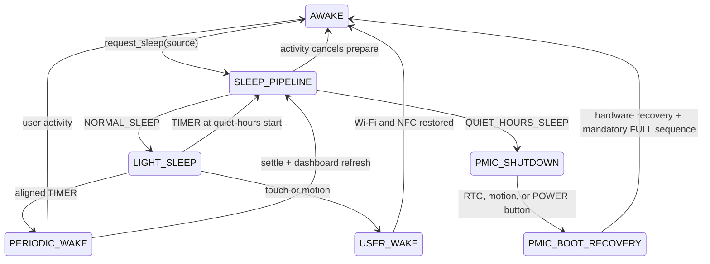

# Gestión de energía

[English](../Power_Management.md) | [Español](Power_Management.md)

El dispositivo tiene dos mecanismos de bajo consumo distintos: ESP32 light sleep, que puede despertar periódicamente sin reiniciar, y el apagado del M5PM1, que retira la alimentación del ESP32 y requiere un nuevo arranque. Toda solicitud de sleep pasa por una única ruta. El reloj actual elige el modo: fuera de las horas silenciosas entra en light sleep; dentro de ellas usa el apagado del PMIC.

## Ruta unificada de sleep

Todos los orígenes llaman al mismo punto de entrada: timeout de inactividad, planificador de actividad, recuperación por TIMER periódico, TIMER de horas silenciosas, `sleep_now` y `shutdown_until`. Internamente es `request_sleep_(source)` (con una forzada explícita de horas silenciosas solo para `shutdown_until`).

`determine_sleep_mode_()` es la única decisión sobre horas silenciosas. Si la hora actual está dentro de la ventana, o `shutdown_until` ha forzado la ruta nocturna, el modo es `QUIET_HOURS_SLEEP`. En otro caso es `NORMAL_SLEEP`. Una sesión temporal de usuario durante la noche no cancela las horas silenciosas para el resto de la noche: la siguiente solicitud de sleep vuelve a consultar el reloj.

La preparación es compartida, pero el paso visual depende del modo:

1. Ignorar una solicitud duplicada mientras la ruta ya está activa.
2. Salir de Controls si es necesario.
3. Desactivar la política del LED de estado (`status_led_sleep_pending`).
4. Solo para `QUIET_HOURS_SLEEP`: establecer `sleep_visual_active` y confirmar una actualización de tinta electrónica con ZZZ, salvo que un caller como una ruta periódica de horas silenciosas ya la haya confirmado.
5. Para `NORMAL_SLEEP`: dejar el panel tal como está. No establecer ZZZ ni solicitar una actualización exclusiva de sleep. Esperar a la pantalla solo si ya hay una actualización en curso (salida de Controls o actualización del panel durante wake periódico).
6. Reevaluar el modo (el reloj puede haber cruzado el inicio de las horas silenciosas durante la espera).
7. Apagar la luz frontal si todavía está encendida.
8. Desactivar Wi-Fi.
9. Configurar las fuentes de wake y, para light sleep, detener NFC.
10. Entrar en `esp_light_sleep_start()` o en el apagado del M5PM1.

Wi-Fi permanece activa durante la espera de la tinta electrónica para que una notificación aún pueda cancelar la ruta. Solo se desconecta inmediatamente antes del sleep/apagado físico.

## NORMAL_SLEEP

Light sleep mantiene el ESP32 en retención de RAM y **conserva el panel actual en la tinta electrónica** (hora, clima, sensores). No hay overlay ZZZ ni actualización adicional solo para entrar en sleep, de modo que el panel sigue pareciendo un reloj activo mientras el ESP32 duerme. El temporizador se alinea con el siguiente múltiplo del intervalo configurado cuando la hora de HA es válida; sin hora válida usa un intervalo completo. Un temporizador diurno puede acortarse hasta el inicio de las horas silenciosas para que el wake use la ruta nocturna en lugar de una actualización periódica. Las fuentes de wake siguen siendo el temporizador, el GPIO táctil y PMIC EXT1 (movimiento).

## QUIET_HOURS_SLEEP

Las horas silenciosas son una arquitectura separada, no un intervalo de light sleep más largo. El firmware establece `sleep_visual_active`, pinta ZZZ con una última actualización, espera a que el panel quede inactivo, programa el RTC RX8130 a `quiet_hours_end` (o al `wake_at` de `shutdown_until`), mantiene el dominio L1 del M5PM1 para wake de RTC/BMI270/POWER y ejecuta el apagado del PMIC. No hay wakes periódicos `/5` mientras la alimentación del ESP32 está desconectada. Establecer el inicio igual al fin desactiva la ventana.

El táctil no puede despertar el dispositivo desde el apagado del PMIC. Sí pueden hacerlo RTC, movimiento y POWER. Un wake por movimiento o POWER durante las horas silenciosas establece `quiet_hours_user_override` como marcador informativo de arranque; no evita el modo de sleep. El siguiente timeout de inactividad vuelve a consultar `determine_sleep_mode_()` y retorna a `QUIET_HOURS_SLEEP` si el reloj sigue dentro de la ventana.

## Visual de sleep (ZZZ)

`sleep_visual_active` significa **apagado prolongado / horas silenciosas**, no “cualquier sleep”. El renderizador solo lee ese flag. `NORMAL_SLEEP` nunca lo establece, por lo que el panel conserva el dashboard. La ruta de horas silenciosas establece el flag antes de su única actualización final y lo borra al cancelar. Si una recuperación TIMER periódica cae dentro de las horas silenciosas, esa actualización de estabilización ya incluye ZZZ y el apagado no pinta un segundo frame.

## Cancelación

El táctil, una notificación o movimiento relevante durante la preparación llaman a `cancel_sleep_pipeline_()`: se limpian la fase pendiente, el visual, el LED de sleep y los temporizadores manuales de HA. Si se había pintado ZZZ, el táctil/movimiento restaura el panel activo con una actualización `sleep_cancel`; la notificación usa su propia actualización a pantalla completa. `NORMAL_SLEEP` nunca armó ZZZ, por lo que no necesita esa actualización de restauración. Una IRQ táctil de último momento que siga baja después de armar las fuentes de wake aborta `esp_light_sleep_start()`, restaura Wi-Fi y permanece en la ruta o cede a la cancelación por actividad.

## AWAKE, actividad y wake periódico

El táctil y el movimiento del BMI270 son las únicas fuentes de actividad. La actividad enciende la luz frontal con el brillo configurado, reinicia el tiempo de inactividad y cancela una transición de sleep pendiente. Los botones físicos de navegación/POWER, NFC, actualizaciones de Home Assistant, trabajo de pantalla, feedback del buzzer y trabajo del LED de estado no reinician el reloj de actividad. El reloj de inactividad empieza al arrancar. Los timeouts de luz frontal y sleep son independientes.

Otros wakes TIMER habilitan Wi-Fi pero mantienen NFC apagado, esperan hasta 30.000 ms a Wi-Fi/API y después pasan 1.750 ms en SETTLE. La actualización posterior actualiza el panel sin ZZZ, y la misma ruta `request_sleep_()` vuelve a entrar en `NORMAL_SLEEP` conservando ese frame. Si el reloj está dentro de las horas silenciosas en ese momento, la actualización de estabilización incluye ZZZ y la ruta usa `QUIET_HOURS_SLEEP`. La actividad del usuario cancela la recuperación periódica y restaura el funcionamiento activo, incluido NFC.

La acción nativa `sleep_now` es una solicitud de sleep. Si las horas silenciosas están activas sigue `QUIET_HOURS_SLEEP`; en otro caso usa light sleep. Su `wake_at` opcional selecciona un wake de light sleep a una hora del día cuando el modo es `NORMAL_SLEEP`. `shutdown_until` fuerza la arquitectura de apagado del PMIC y requiere un `wake_at` válido.

## Wake del usuario

El táctil despierta mediante el GPIO táctil. El movimiento se enruta mediante BMI270 → M5PM1 GPIO4. El wake del usuario habilita Wi-Fi y reanuda NFC. Si había un frame ZZZ de horas silenciosas en el panel, se borra el flag visual y se restaura el dashboard. Después de `NORMAL_SLEEP` el dashboard ya está en el panel, por lo que no hace falta una actualización adicional. El wake TIMER mantiene NFC apagado y, fuera de las horas silenciosas, deja el dashboard preparado para el siguiente retorno a light sleep.

## Recuperación de arranque del PMIC

Después de un wake del PMIC reconocido, el ESP32 arranca de nuevo. Se restauran M5IOE1, alimentación/reset de la tinta electrónica, táctil y hardware de la luz frontal. El baseline de la pantalla se invalida y se requiere un `MANDATORY_FULL` inicial antes de cualquier PARTIAL. La recuperación espera después la conexión Wi-Fi/API; esta espera no usa el fallback de 30 segundos del wake periódico. Una vez conectada HA, se consulta durante hasta 5 segundos la información necesaria del panel. Lleguen todos los datos o expire ese timeout, el firmware solicita un `RefreshKind::MANDATORY_FULL` final para pintar el estado disponible definitivo, después del cual pueden usarse actualizaciones PARTIAL.

Entre los logs útiles están `PMIC boot cause`, `PMIC wake recovery summary`, `PMIC wake: EPD ready` y `PMIC boot: mandatory initial FULL complete`. Con USB/5VIN presente, se sigue emitiendo el comando de apagado, pero la alimentación externa puede volver a alimentar inmediatamente el rail del ESP32, por lo que el dispositivo puede no permanecer apagado.
